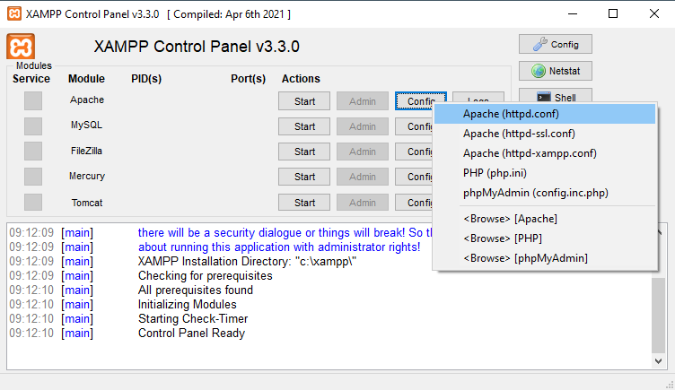
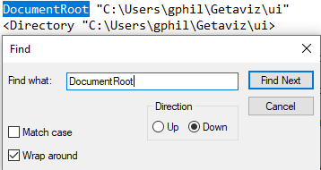

# VISAP
This project aims to be a revamp of https://github.com/softvis-research/Getaviz. In particular, it aims to reduce bloat in its source code while merging a lot of the features of Getaviz that were previously built separately through the efforts of many individual contributors.

## Current State
The project is currently in a pre-development phase. Porting of functionality from Getaviz is still ongoing, and while we have a rough idea of where we want to go, many important design decisions are yet to be made.

## Installation

### Compiling the Generator

This project requires a JDK version of 12 or higher.

The generator project is built using Maven. Open the project in your IDE of choice by importing the pom.xml file in the generator/ directory and then building the project.

### Initializing the Graph Database

VISAP uses a local Neo4J graph database to generate its model. Download a current version of Neo4J, then set up a new local project there. Setting a password is required, but authorization will be disabled during development.

Make the following changes to the configuration of that database (… > Settings):
- Comment out ```server.directories.import=import``` by prepending #
- Set ```dbms.security.auth_enable``` to ```false```
- De-comment ```dbms.security.allow_csv_import_from_file_urls=true``` by removing the leading #

Then, start the database. The authorization being disabled may cause warnings on start-up, which can be dismissed.

### Generating a Model

- Ensure that the Neo4J database is running
- Place input CSV files in the directory ```generator/src/neo4jexport```. This directory contains several sub-directories with example data.
- Execute the file ```generator/src/main/java/org.visap.generator/steps/LoaderStep.java```. This will place the initial data in the local graph database. Any previously contained data is overwritten!
- Execute the file ```generator/src/main/java/org.visap.generator/steps/AFrameExporterStep.java```. This will run all additional model-generating steps. Depending on the model size, this process can take a few minutes to finish.

The resulting model files (model.html and metaData.json) are placed in the neo4jexport/ folder along with your input data.

### Displaying a Model in the Browser

| :warning: WARNING                                                                                                                                                                                                     |
|:----------------------------------------------------------------------------------------------------------------------------------------------------------------------------------------------------------------------|
| Before you get started with displaying your model in the browser, you will need a ```node_modules/``` folder in the ```ui/``` folder. Unfortunately, we are currently unable to upload this folder to the repository. |

After following the instructions in section [Generating a Model](#generating-a-model), two files will have been generated for you: model.html and metaData.json.

To display the model in the browser, first navigate to the folder ```ui/data/```. Create a subfolder with a name of your liking, for example ```Test/```. Inside the newly created subfolder, create another subfolder named ```model/```. Copy both the model.html file and the metaData.json file into this subfolder.

Next, you will need a webserver. We recommend [XAMPP](https://www.apachefriends.org/download.html).



Click on the config for Apache and select Apache (httpd.conf). Change the path behind ```DocumentRoot``` and in ```<Directory "...">``` to match the location of the ui folder. Alternatively, create a symbolic link to the folder in the existing document root, in which case the symlink name should be inserted correspondingly after "localhost/" for all following localhost URLs.



Save the config, close it, and start the Apache Module.

You should now be able to view the visualization in the browser.
Enter the URL http://localhost/index.php?setup=ABAP/PackageExplorer&model={folderName}, where ```{folderName}``` is the name of the folder inside which you created the ```model/``` subfolder.

In our example, it is named ```Test```, so the complete URL will be http://localhost/index.php?setup=ABAP/PackageExplorer&model=Test.

The visualization will look similar to this:


## Documentation
The development team actively uses and maintains https://miro.com/app/board/uXjVOGFnA-M=/ for project coordination and documentation. The Miro board also includes instructions for installation and usage. Access requests will generally be accepted. Most documentation is currently available in German only.

If you need help or have any suggestions, we appreciate your interest in the project, and hope you will file an issue or message the contributors directly.
